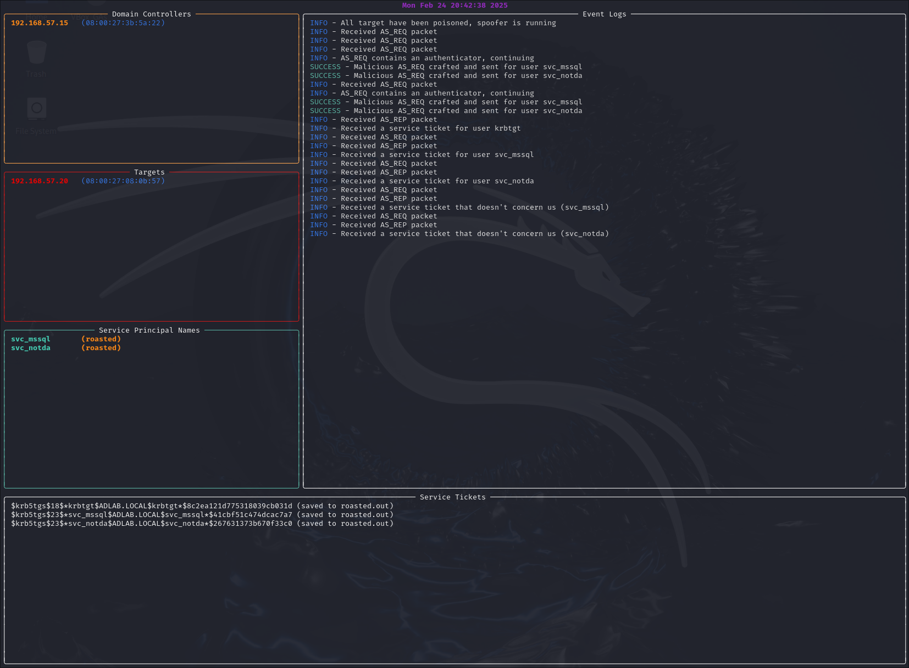

## AxiomRoaster

Zero-auth Kerberoasting utility



How to achieve Kerberoasting with no authentication ?
- ARP poisoning
- MITM full packet relaying
- Interception of legitimate authenticators (encrypyted timestamps)
- AS-REQ crafting to request service tickets without a valid TGT
- Forced RC4 downgrade to improve cracking speed
- Sweet looking terminal for cool screenshots in your reports
- And more… :)

TODO list :
- Implement AS_REQ roasting for relayed authenticators.
- Implement self-made full packet relaying, instead or relaying on Linux's kernel doing it for us. This will allow for more control over what we send and block.

## Note

IMPORTANT : The tool does not yet implement automated full-duplex relaying. It instead depends on the Linux Kernel to do it for you. Make sure to enable IP forwarding :

```bash
$ sudo sysctl net.ipv4.ip_forward=1
```

## Installation

This is a standard PIP package, simply run :

```bash
$ git clone git@github.com:mallo-m/AxiomRoaster.git
$ cd AxiomRoaster
$ python3 -m venv venv
$ source ./venv/bin/activate
$ python3 -m pip install .
$ axiom-roaster -h
```

## Usage

```bash
usage: axiom-roaster [-h] --iface IFACE --dcs DCS [DCS ...] --targets TARGETS [TARGETS ...] --spn SPN [SPN ...] [--source-mac SOURCE_MAC]

Zero-auth Kerberoasting and AS-REQ roasting

options:
  -h, --help            show this help message and exit
  --iface IFACE         The interface to listen/attack on
  --dcs DCS [DCS ...]   List of domain controllers to relay authenticators to. Usually one is enough.
  --targets TARGETS [TARGETS ...]
                        List of IP to poison, at least one is required
  --spn SPN [SPN ...]   List of SPNs to attack
  --source-mac SOURCE_MAC
                        Our MAC address. Where to redirect packets to. If not provided, retrieved automatically from the specified interface.
```

Example usage :

```bash
$ sudo axiom-roaster --iface eth0 --dcs 192.168.57.15 --targets 192.168.57.20 --spn svc_mssql svc_not_a_da
```

## Community

Opening issues or pull requests very much welcome.
Suggestions welcome as well.


